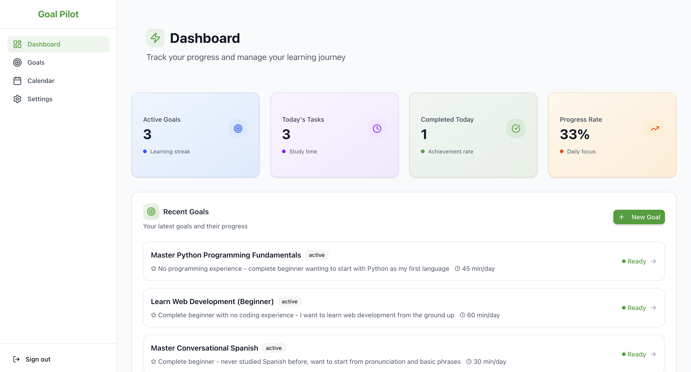
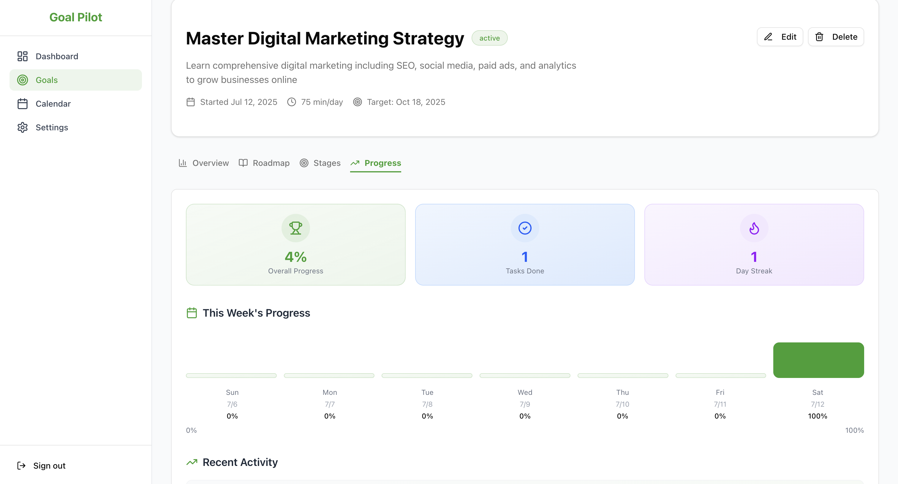
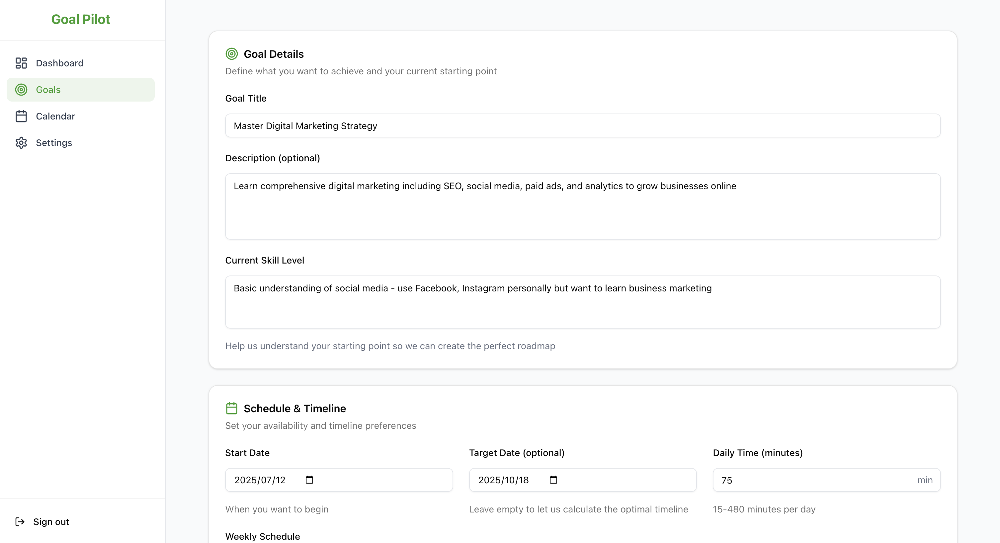
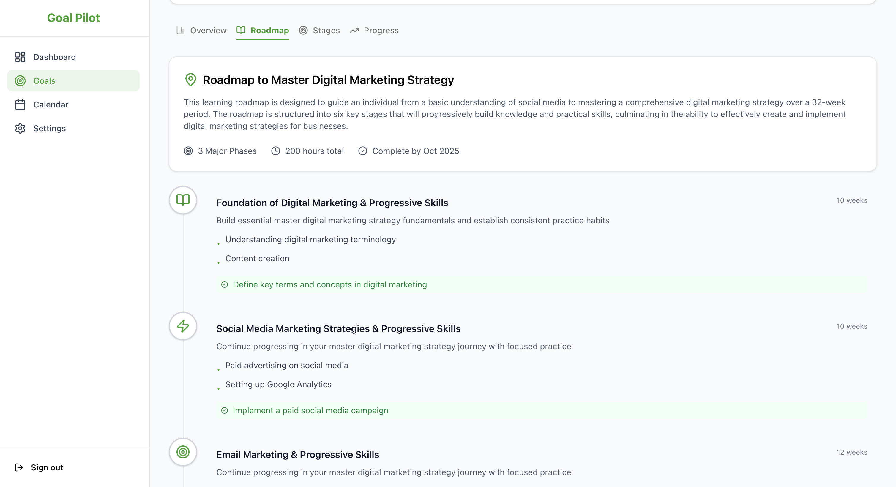
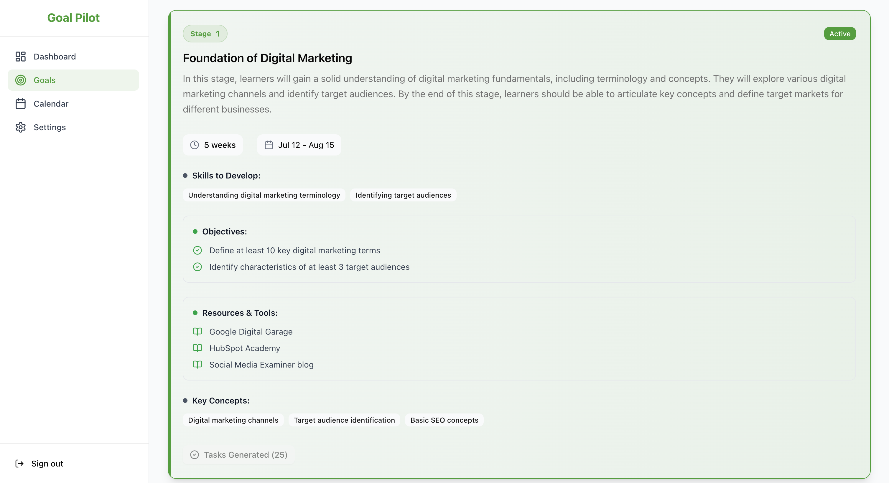
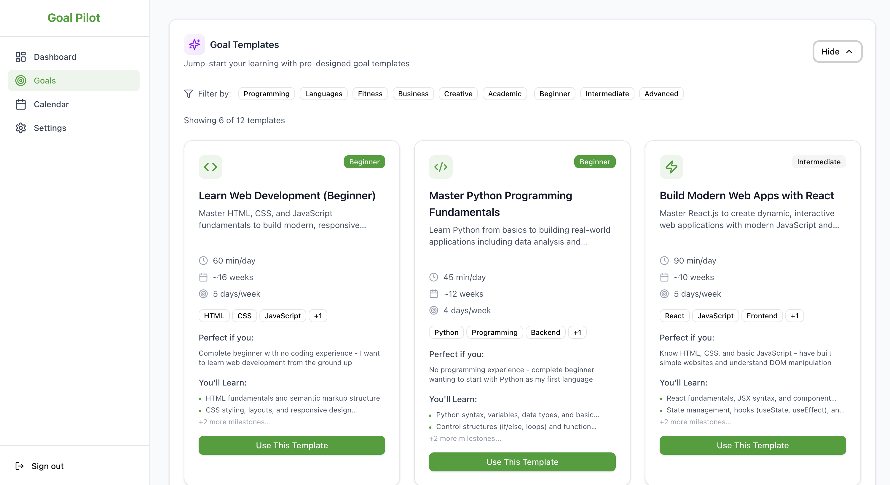
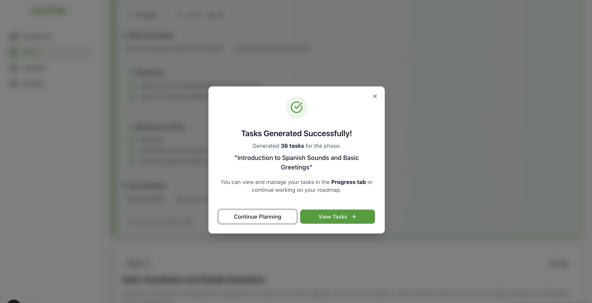
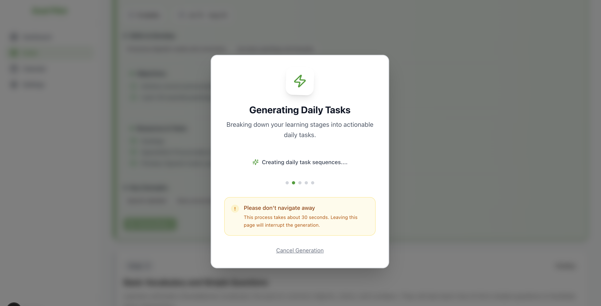
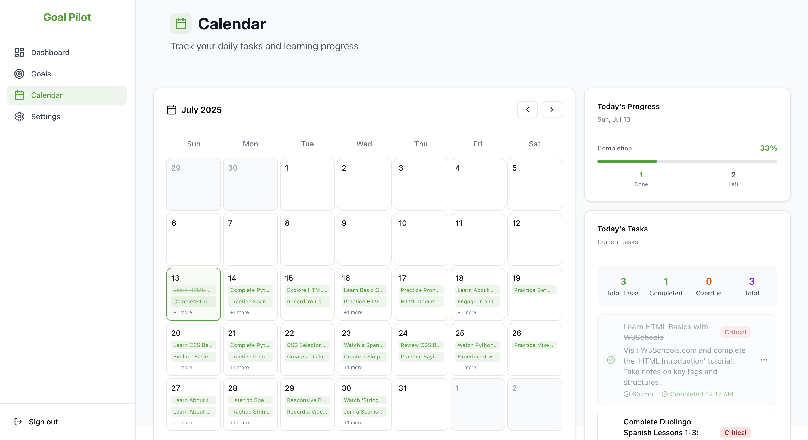

# Goal Pilot - AI-Powered Goal Achievement & Learning Management

Transform your long-term goals into manageable daily actions through intelligent roadmap generation, smart scheduling, and comprehensive progress tracking.

## Live Demo

**[Try Goal Pilot →](https://goal-pilot-ai.vercel.app)**

Experience the full functionality with our interactive demo deployment.

## Tech Stack

**Frontend**

- Next.js 15 with App Router & Turbopack
- TypeScript + Tailwind CSS + shadcn/ui
- Jotai + React Query for state management

**Backend & Database**

- Supabase (PostgreSQL) with Row Level Security
- Supabase Auth for authentication

**AI & Tools**

- OpenAI gpt-4o-mini for roadmap generation
- pnpm for package management

**Testing**

- Vitest with jsdom for unit and integration testing
- MSW (Mock Service Worker) for API mocking
- Testing Library for React component testing

## Key Features

- **AI-Powered Goal Planning**: Intelligent roadmap generation with personalized learning paths
- **Smart Scheduling**: Adaptive time management with calendar integration
- **Progress Tracking**: Visual dashboard with completion analytics and milestone tracking
- **Responsive Design**: Mobile-first approach with performance optimization

## Demo Screenshots

<div align="center">

### Dashboard & Overview

<table>
<tr>
<td width="50%" align="center" valign="top">

<br/>
<em>Main dashboard with goal overview and progress tracking</em>
</td>
<td width="50%" align="center" valign="top">

<br/>
<em>Detailed progress analytics and milestone tracking</em>
</td>
</tr>
</table>

### Goal Creation & Roadmap

<table>
<tr>
<td width="50%" align="center" valign="top">

<br/>
<em>Interactive goal creation with scheduling preferences</em>
</td>
<td width="50%" align="center" valign="top">

<br/>
<em>AI-powered roadmap generation with learning stages</em>
</td>
</tr>
</table>

### Stages & Templates

<table>
<tr>
<td width="50%" align="center" valign="top">

<br/>
<em>Structured learning stages with detailed breakdown</em>
</td>
<td width="50%" align="center" valign="top">

<br/>
<em>Pre-built goal templates for quick start</em>
</td>
</tr>
</table>

### AI-powered daily task generation from progress stages

<table>
<tr>
<td width="50%" align="center" valign="top">

</td>
<td width="50%" align="center" valign="top">

</td>
</tr>
</table>

### Smart calendar integration with task scheduling

<div align="center">

</div>

</div>

## Quick Start

```bash
# Install dependencies
pnpm install

# Set up environment variables
cp .env.local.example .env.local

# Start development server
pnpm run dev
```

## Development Commands

```bash
# Development
pnpm run dev              # Start development server
pnpm run build           # Build for production
pnpm run start           # Start production server

# Code Quality
pnpm run lint            # Run ESLint
pnpm run format          # Format with Prettier
pnpm run type-check      # TypeScript checking

# Testing
pnpm run test            # Run all tests once


# Database (with Supabase CLI)
pnpm run supabase:start  # Start local Supabase
pnpm run supabase:reset  # Reset local database
```

## Environment Variables

```env
NEXT_PUBLIC_SUPABASE_URL=your_supabase_url
NEXT_PUBLIC_SUPABASE_ANON_KEY=your_supabase_anon_key
SUPABASE_SERVICE_ROLE_KEY=your_service_role_key
OPENAI_API_KEY=your_openai_api_key
NEXT_PUBLIC_APP_URL=http://localhost:3000
```

## Project Structure

```
goal-pilot/
├── app/                     # Next.js App Router
│   ├── (auth)/             # Authentication pages (login, register, reset)
│   ├── (app)/             # Protected app pages
│   ├── actions/            # Server Actions for data mutations
│   ├── api/                # API routes for external integrations
│   └── auth/               # Auth callback and error handlers
├── components/             # React Components (Atomic Design)
│   ├── atoms/              # Basic UI building blocks (shadcn/ui components)
│   ├── molecules/          # Composite components
│   ├── organisms/          # Complex feature components
│   └── providers/          # React Context providers
├── lib/                    # Utilities and configurations
│   ├── ai/                 # OpenAI integration and prompts
│   ├── hooks/              # Custom React hooks
│   ├── supabase/           # Database client configuration
│   ├── utils/              # Utility functions and helpers
│   └── validations/        # Zod validation schemas
├── store/                  # Jotai state management atoms
├── types/                  # TypeScript type definitions
├── supabase/              # Database schema and migrations
│   ├── migrations/         # Database migration files
│   └── config.toml        # Supabase local configuration
└── docs/                  # Project documentation
```

## Database Schema

### Core Tables

- **users**: User profiles and preferences
- **goals**: User goals with scheduling preferences and AI parameters
- **roadmaps**: AI-generated learning roadmaps linked to goals
- **progress_stages**: Structured stages within roadmaps
- **tasks**: Daily tasks derived from progress stages
- **milestones**: Progress tracking milestones

## Testing

This project uses **Vitest** as the test runner with a comprehensive testing setup:

### Test Framework

- **Vitest**: Fast unit test runner with native TypeScript support
- **jsdom**: Browser environment simulation for React component testing
- **MSW**: Mock Service Worker for API mocking
- **Testing Library**: React component testing utilities

### Test Structure

```
tests/
├── components/          # Component tests
│   ├── atoms/          # Atomic UI component tests
│   ├── molecules/      # Molecule component tests
│   └── organisms/      # Complex component tests
├── hooks/              # Custom hook tests
├── pages/api/          # API route tests
├── mocks/              # MSW mock handlers and data
│   ├── handlers/       # API mock handlers
│   └── data/           # Mock data using database types
└── utils/              # Test utilities and helpers
```

### Running Tests

```bash
# Run all tests once
pnpm run test
```

### Test Features

- **Type Safety**: All tests use generated database types from `/types/database.ts`
- **API Mocking**: MSW handles all API calls during testing
- **Environment**: Test environment variables are configured in `vitest.config.mts`
- **React Testing**: Custom render utility with providers setup
- **Database Types**: Mock data factories using actual database schemas
